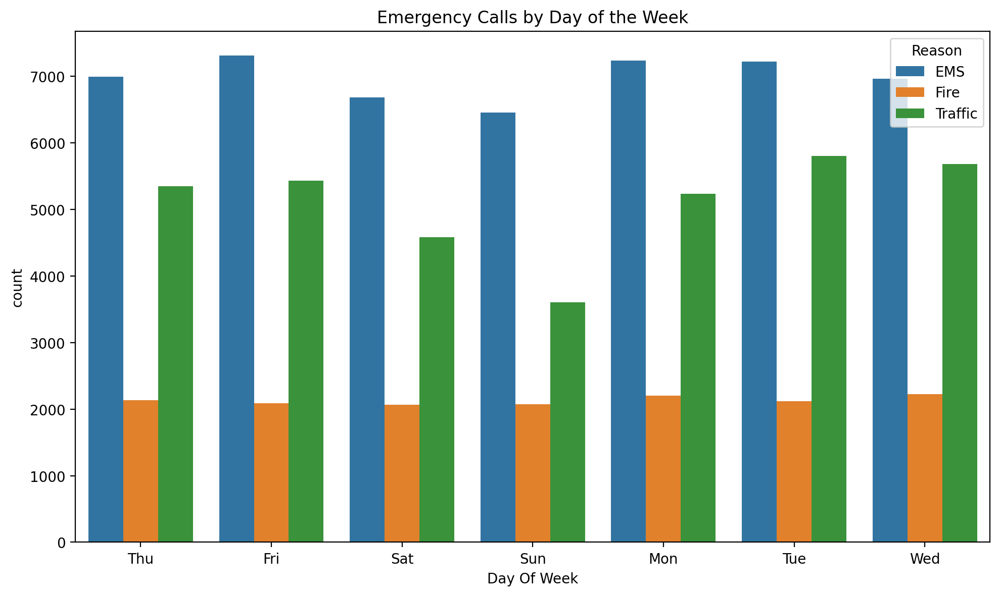
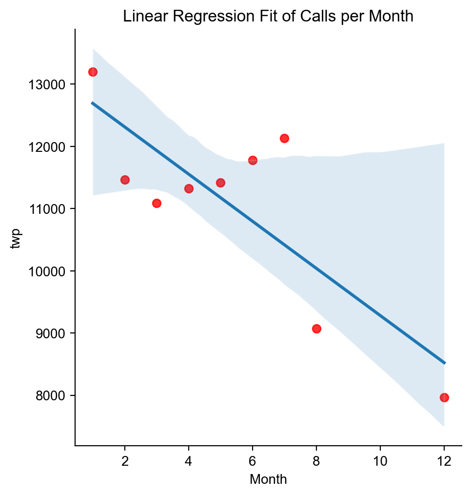
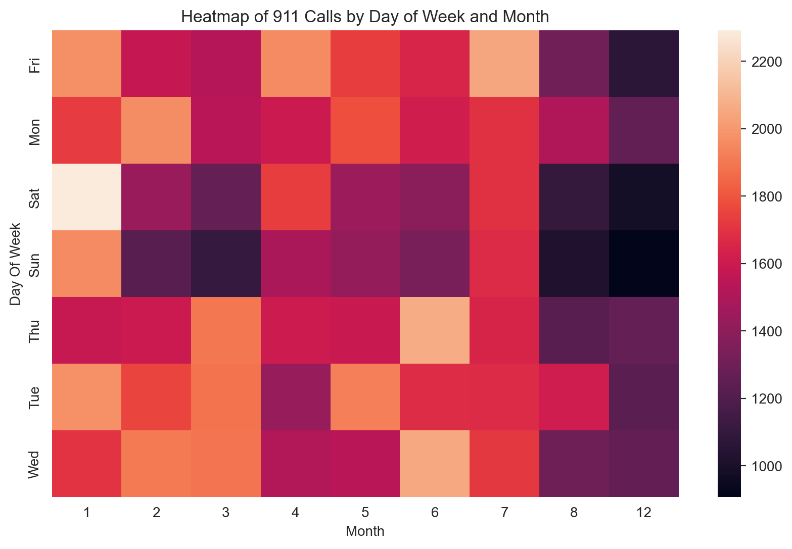

# 📊 911 Calls Data Analysis

This project explores **911 emergency call data** to identify key patterns and insights.  
The dataset includes information such as call reason, timestamp, location (latitude, longitude, township, zipcode),  
and descriptive details about each emergency call.

---

## 🎯 Objectives
- Analyze call frequency by reason (Traffic, Fire, EMS).  
- Explore temporal trends (by hour, day of week, month).  
- Visualize spatial and time-based distributions.  
- Derive insights that can help understand emergency response demands.  

---

## 🛠 Tools Used
- **Python**  
- **Pandas, NumPy** for data handling  
- **Matplotlib, Seaborn** for visualization  

---

## 📈 Visualizations

### 1. Calls by Day of the Week

### 2. Calls per Month (Linear Regression) 
  

### 3. Calls Heatmap by Day of Week and Month 
  

---

## ✅ Conclusion
This project demonstrates how data analysis and visualization can uncover patterns in emergency call data.  
By exploring temporal and categorical trends, we can better understand demand for emergency services and  
identify peak times for different types of incidents.
